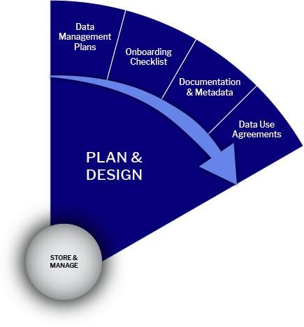

# Plan & Design Stage

<figure><figcaption>
Plan &#x26; Design Stage
</figcaption></figure>

## **Plan & Design Stage – Summary Table**

<table data-header-hidden><thead><tr><th width="284"></th><th></th></tr></thead><tbody><tr><td><strong>Category</strong></td><td><strong>Details &#x26; Best Practices (UCPH · reNEW · EU Funders)</strong></td></tr><tr><td><strong>Stage Purpose</strong></td><td>Define <strong>what data will be collected, created, or reused</strong> and <strong>how it will be managed</strong> across the research lifecycle. Establish a <strong>Data Management Plan (DMP)</strong> as both a <strong>planning tool and a compliance document</strong>.</td></tr><tr><td><strong>Key Output</strong></td><td><strong>Data Management Plan (DMP)</strong> – living document that captures:• Data to be collected/created/reused• Storage and backup strategy• Access permissions and roles• Metadata and documentation plan• Compliance with GDPR and funder policies</td></tr><tr><td><strong>Funders &#x26; Policy Drivers</strong></td><td><ol><li><strong>Horizon Europe / ERC:</strong> Require <strong>formal DMP submission</strong> (first 6–12 months of project).</li><li><strong>Danish funders</strong> increasingly encourage DMPs aligned with <strong>FAIR and Open Science</strong> principles.- <strong>UCPH &#x26; reNEW:</strong> Follow institutional <strong>Research Data Management Policy</strong>.</li></ol></td></tr><tr><td><strong>Internal UCPH / reNEW Practice</strong></td><td><ol><li><strong>Recommended for all projects</strong>, even without funder mandates.</li><li>DMPs should integrate <strong>UCPH-approved storage solutions</strong> (ERDA, REDCap, secure storage).</li><li>Define handling of <strong>sensitive/personal data under GDPR</strong>.</li></ol></td></tr><tr><td><strong>Team Awareness Requirements</strong></td><td>
All team members should know:

1. <strong>Where the data is stored</strong>, including backups

2. <strong>Who can access the data</strong>, and how (authentication/permissions)

3. <strong>How data is organized and documented</strong>, including folder structures, file naming, metadata, and README files
</td></tr><tr><td><strong>Living Document Approach</strong></td><td><ol><li><strong>Update DMP regularly</strong> as the project evolves (new data, new collaborators, changing funder requirements).</li><li>Maintain <strong>traceability and compliance</strong> throughout the project lifecycle.</li><li>Supports <strong>secure storage, data quality, and eventual open sharing</strong>.</li></ol></td></tr><tr><td><strong>Benefits</strong></td><td><ol><li>Ensures <strong>regulatory and funder compliance</strong>.</li><li>Supports <strong>data security and research integrity</strong>.</li><li>Enables <strong>future discoverability, reuse, and Open Science alignment</strong>.</li><li>Provides a <strong>clear operational guide</strong> for all project members.</li></ol></td></tr><tr><td><strong>Roles &#x26; Responsibilities</strong></td><td><strong>PI:</strong> Approves DMP, ensures resources and compliance.<strong>Data Steward/Manager:</strong> Drafts and maintains DMP, ensures FAIR alignment, and manages updates.<strong>Team Members:</strong> Follow DMP procedures for data collection, storage, and documentation.</td></tr><tr><td><strong>Common Risks &#x26; Mitigations</strong></td><td><strong>Risk:</strong> DMP becomes static → <strong>Mitigation:</strong> Schedule regular reviews.<strong>Risk:</strong> Sensitive data mishandled → <strong>Mitigation:</strong> Define GDPR procedures and storage controls.<strong>Risk:</strong> Non‑FAIR structure → <strong>Mitigation:</strong> Use metadata templates and standard folder structures.</td></tr></tbody></table>

