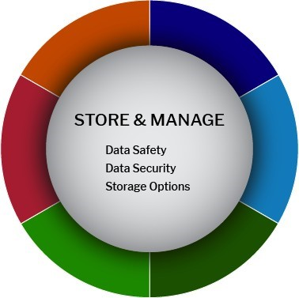

# Store & Manage

<figure><figcaption></figcaption></figure>

Each Stage of the Research Data Lifecycle revolves around data storage management. Proper storage maintenance throughout the lifecycle is imperative to ensure data remains secure and adheres to recommended safety protocols.

Research involves increasingly complex arrangements for the storage and transmission of research data. Robust data privacy and security planning are necessary to protect research subjects' privacy and secure sensitive, personally identifiable information.

In the Plan & Design stage, you may be asked to produce a Data Storage Plan, highlighting specific details related to data storage throughout the project, such as Storage Options.

When beginning to Collect & Create datasets, either the ingestion of data from outside sources or the generation of new datasets, further storage considerations may be addressed, such as Data Security and Data Safety.

Project completion requires additional contemplation strategies to Evaluate & Archive data, to determine where data should be stored, what should be preserved long-term, or to what degree data should be shared, to encourage data reproducibility.

<table data-header-hidden><thead><tr><th width="204.5"></th><th></th><th data-hidden></th></tr></thead><tbody><tr><td>Active Data</td><td>Review the UCPH Research Portal for <a href="https://kunet.ku.dk/work-areas/research/data/personal-data/safe-storage/Pages/default.aspx">safe storage of personal data </a> (see Analyze and Collaborate Stage) <a href="https://kunet.ku.dk/work-areas/research/data/facilities-for-data-storage-and-sharing-in-active-projects/Pages/default.aspx">storage options </a>to understand better where to store data based on behavior, performance, and means of access. A master copy of raw data should be retained, with further changes to subsequent versions well documented.</td><td></td></tr><tr><td>Data preservation</td><td>
<a href="https://kunet.ku.dk/work-areas/research/data/Documents/UCPHPolicyforResearchDataManagement2022-EN.pdf">Refer to the section on Data sharing and Long-term preservation of the UCPH Policy for Research Data Management: Sections 2.6 and 2.7</a>

Consult the <a href="https://kunet.ku.dk/work-areas/research/data/Documents/UCPHPolicyforResearchDataManagement2022-EN.pdf">UCPH Policy for Research Data Management</a> to determine how long the data needs to be retained and/or preserved. Data should be located in appropriate <a href="https://kunet.ku.dk/work-areas/research/data/facilities-for-data-storage-and-sharing-in-active-projects/Pages/default.aspx">storage locations</a> based on usage and function.

<a href="https://kunet.ku.dk/work-areas/research/data/personal-data/Pages/default.aspx">Data Processor Agreement: </a>A data processor agreement obligates the external party (the data processor) to process the data in question as confidential and with a proper security level.
</td><td></td></tr><tr><td>Cost</td><td>Determine whether you will have sufficient storage throughout the process. You may have to incur storage costs for additional services.</td><td></td></tr><tr><td>Data Safety</td><td>
Data safety protocols are designed to protect the welfare of research participants and confirm the integrity of research data. UCPH researchers can submit and maintain the following items through the online <a href="https://kunet.ku.dk/work-areas/research/data/personal-data/impact-assessment/Pages/default.aspx">Risk and Impact Assessments</a>:

●      Reviews of Data Management Plans

●      Communication with reviewers and resource teams

●      Details about the use of data, including project and/or data access team members
<ul><li>How will you protect the identity of participants (i.e., honest broker, anonymized data) according to the <a href="https://kunet.ku.dk/work-areas/research/data/personal-data/Pages/default.aspx">GDPR</a>?</li><li>How will sensitive data be handled to ensure it is stored and transferred securely?</li></ul></td><td></td></tr><tr><td>Software</td><td>How will you protect your hardware and software systems? (e.g., Anti-virus software, systematic plan for updating applications and OS, security system, anti-intrusion software, restricted physical access)</td><td></td></tr><tr><td>Hardware</td><td>What are the appropriate security controls for the physical location(s) where your computers, servers, and data storage reside?</td><td></td></tr><tr><td>Backups</td><td>
Having at least one backup can help prevent data mishaps. The best way to avert data loss is to follow the 3-2-1 Rule:

●    Make 3 copies of the data (e.g., original + external/local + external/ remote)

●    Copies should be geographically distributed (local vs. remote) To construct your data security plan:
<ul><li>How will the data be backed up?</li><li>Where are the backups stored (network drives, remote storage (Cloud/UCPH Dropbox)? </li><li>How frequently do you back up your data?</li><li>How many copies are being made (full or partial copies)?</li><li> Who will be responsible for backup and recovery?</li><li>How will the data be recovered in an incident/disaster?</li><li>How will you protect the identity of participants during data sharing (i.e., honest broker, anonymized data) according to the Common Rule, FERPA, and HIPAA?</li><li>How will sensitive data be handled to ensure it is stored and transferred/shared securely?</li><li>How might managing identifiers affect the usability of the data set for secondary analysis?</li></ul></td><td></td></tr><tr><td>Permissions</td><td>
Ensure data resides in a shared location with more than one owner to help support the longevity and sustainability of research. Personal data should be moved to a shared location before the completion of a project or departure from a lab.

The notion of shared ownership should apply to various storage locations, including <a href="https://kunet.ku.dk/newsroom/news/pages/new-digital-tool-makes-work-in-sund&#x27;s-laboratories-smarter.aspx">Electronic Lab Notebook</a>s and website content.
</td><td></td></tr></tbody></table>
