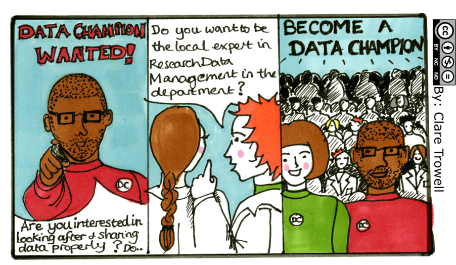

# What are Data Champions?

Research Data Champions (RDCs) are volunteers who advise research community members on properly handling research data. They promote good research data management (RDM) and support Findable, Accessible, Interoperable, and Re-usable (FAIR) research principles.

RDC aims to raise awareness of the importance of FAIR research data management (RDM), offers numerous services to provide researchers at reNEW with comprehensive RDM support, and serves as your group's central point of contact.

<figure><figcaption>
Illustrations: Connie, Clare
</figcaption></figure>

## Research Data Champions are Volunteers from each research group who:

*

    <figure><figcaption></figcaption></figure>
*

    <figure><figcaption></figcaption></figure>
*

    <figure><figcaption></figcaption></figure>

<figure><figcaption>
Illustrations: Connie, Clare
</figcaption></figure>

## How can Research Data Champions benefit from this network?

### Participants benefit from:

*

    <figure><figcaption></figcaption></figure>
*

    <figure><figcaption></figcaption></figure>
*

    <figure><figcaption></figcaption></figure>
