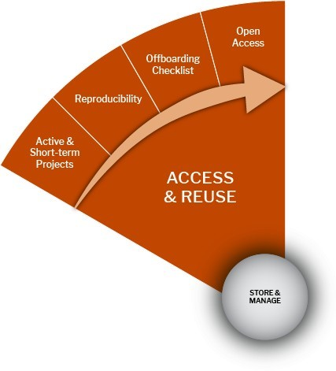

# 🟠 Access & Reuse Stage

<figure><figcaption></figcaption></figure>

## Access & Reuse Stage:

<table data-header-hidden><thead><tr><th width="226.5"></th><th></th><th data-hidden></th></tr></thead><tbody><tr><td>License for Reuse</td><td>
Access &#x26; Reuse Stage

Promote sharing and use of your data by making it available under an appropriate license to ensure proper reuse and attribution. Many licenses are available that represent the range of rights for the creator and licensee of the data.
<ul><li><a href="https://opendatacommons.org/">Open Data Commons License</a>: a set of legal tools and licenses to help you publish, provide, and use open data.</li><li>
<a href="https://creativecommons.org/license">Creative Commons License</a>: provides a standardized way to grant the public permission to use their creative work under copyright law (use the <a href="https://creativecommons.org/choose/">License Chooser </a>to explore Creative Commons licenses and determine which license to choose from).
<ul><li><a href="https://creativecommons.org/share-your-work/public-domain/cc0/">Public Domain (CC0) </a>is frequently suggested for open data. They rely on community norms for attribution, and they prevent the problem of attribution stacking, where a researcher uses data from multiple datasets and provides attribution for each component.</li><li><a href="http://creativecommons.org/licenses/by/4.0/">Attribution (CC BY) </a>is recommended for maximum dissemination and use of licensed materials.</li></ul></li></ul></td><td></td></tr><tr><td>Restrictions and Conditions of Reuse</td><td>
<a href="https://kunet.ku.dk/work-areas/research/data/Documents/UCPHPolicyforResearchDataManagement2022-EN.pdf">Refer to the section on the Data sharing of the UCPH Policy for Research Data Management: Section 2.6</a>

Some data are openly available for immediate use via repositories, while other data may be available by request in restricted repositories. Some datasets and resources may come with reuse requirements. Read any data license carefully to be sure you will be allowed the use you want.

Ensure proper protection when sharing data by adding restrictions or conditions of reuse:   

 

Will data sharing be postponed/restricted? (e.g., to publish or seek patents)
<ul><li>What is the contract termination/data destruction circumstances for the requester using your data?</li><li>Do you need/have a Data Processor Agreement?</li></ul>
<a href="https://kunet.ku.dk/work-areas/research/data/personal-data/Pages/default.aspx">Data Processor Agreement: </a>A data processor agreement obligates the external party (the data processor) to process the data in question as confidential and with a proper security level.
</td><td></td></tr><tr><td>Citations and Acknowledgement</td><td>“Data citation helps promote the reproduce-ability of research results. It allows us to track the usage and impact of data, and it provides a structure by which we can recognize and reward data creators.” (<a href="http://www.datacite.org/">www.DataCite.org</a>)</td><td></td></tr></tbody></table>
