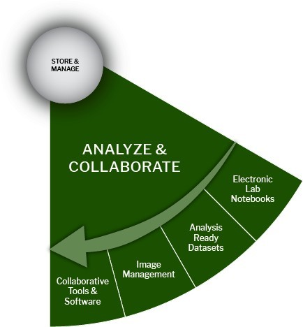

# 🔵 Analyze & Collaborate Stage

<figure><figcaption></figcaption></figure>

## Analyze & Collaborate Stage:

Data analysis inspects, cleans, transforms, and models’ data to discover useful information, informing conclusions, and support decision-making in the Analyze and Collaborate Stage. The choices you make while analyzing your data can also contribute to effectively managing your research data:

Document your steps: Consider the software you use for analysis and whether those applications automatically generate information about your data files and process steps. Keeping track of your steps can save time when you want to recreate your work or share your methodology with others! Use Electronic Lab Notebooks, Collaborative Tools & Software, and Image Management platforms.

Keep your data safe: Describe your data as you capture it, organize your files, and make intelligent choices about where you store it. Since some software programs produce proprietary files and can only be opened in their applications, consider saving data in formats that different software programs can open. Ensure you are working with Analysis Ready Datasets.

<table data-header-hidden><thead><tr><th width="205.5"></th><th></th><th data-hidden></th></tr></thead><tbody><tr><td>Active Data</td><td>Review <a href="https://kunet.ku.dk/work-areas/research/data/facilities-for-data-storage-and-sharing-in-active-projects/Pages/default.aspx">Data Storage and Sharing options </a>to understand better where to store data based on behavior, performance, and means of access. A master copy of raw data should be retained, with further changes to subsequent versions well documented.</td><td></td></tr><tr><td>Analysis Ready Datasets</td><td>Analysis-ready datasets have been responsibly collected and reviewed so that analysis of the data yields clear, consistent, and error-free results to the greatest extent possible. When working on a research project, ensure that your data is safe, authentic, and usable. Since raw data is often unstructured, with data management, data cleaning is part of the analysis process.</td><td></td></tr><tr><td>Document Your Process</td><td>Consider the software you use for analysis and whether those applications automatically generate documentation about your data files and process steps. Keeping track of your steps can save you time when you want to recreate your work or share your methodology with others.</td><td></td></tr><tr><td>Data Analytics</td><td>Data analysis inspects, cleans, transforms, and models data to discover useful information, inform conclusions, and support decision-making.</td><td></td></tr><tr><td><a href="https://kunet.ku.dk/work-areas/research/data/facilities-for-data-storage-and-sharing-in-active-projects/Pages/default.aspx">Data Storage and Collaboration</a></td><td>UCPH IT provides various storage solutions, from shared drives to solutions for collaboration. Click on ‘Data Storage and Collaboration’ for an overview of available data storage and collaboration services to meet your active research project’s needs.</td><td></td></tr><tr><td>OneDrive (or other cloud storage)</td><td><a href="https://kunet.ku.dk/employee-guide/ITvejl/OneDrive%20-%20Usermanual.pdf">OneDrive for Business</a> (and other cloud-sharing options) offer secure ways to store, synchronize, and share data across platforms and the globe. It keeps your computer up to date with your working files. OneDrive for Business is not suitable for the storage and sharing of sensitive data.</td><td></td></tr><tr><td>Collaborate Wiki Spaces</td><td>Interactive wiki-type platforms can offer researchers web-based project management and content collaboration solutions.</td><td></td></tr><tr><td>High-Performance Computing</td><td><a href="https://kunet.ku.dk/work-areas/research/Research%20Infrastructure/research-it/computerome-2.0/Pages/default.aspx">High-Performance Computing </a>(HPC) clusters offer the equivalent computational power of thousands of workstations and can help make your analysis more efficient and faster.</td><td></td></tr><tr><td>Electronic Lab Notebooks</td><td>Consider using an <a href="https://kunet.ku.dk/newsroom/news/pages/new-digital-tool-makes-work-in-sund&#x27;s-laboratories-smarter.aspx">Electronic Lab Notebook</a> for data collection. Electronic notebooks allow users to enter protocols, observations, notes, and other data using a computer or mobile device.</td><td></td></tr><tr><td>GitHub</td><td>
<a href="https://github.com/">Version control </a>can help you understand how the code or writing came to be, who wrote or contributed parts, and who you might ask to help you understand it better. While not meant to be a backup solution, using version control systems means that your code and writing can be stored on multiple other computers.

Git is the most common and widely accepted version control software, which you can run locally on your computer or through services like GitHub or Bitbucket. With Git, you can have versions of the project, not just versions of each File as in Google or Dropbox. When using Git, you are prompted along the way to add comments to your changes, allowing you to capture the documentation of a project.

<a href="https://git-scm.com/">Git </a>is a free, open-source tool that can be downloaded to your local machine and used for logging all changes made to a group of designated computer files over time. It can be used to control file versions locally by you alone on your computer and to coordinate simultaneous work on a group of files shared among a group of people.

<a href="https://github.com/">GitHub </a>is a popular website for hosting and sharing Git repositories remotely. It offers a web interface and provides functionality and a mixture of free and paid services for working with such repositories.
</td><td></td></tr><tr><td>Image Management</td><td>
Images can be collected in several ways, such as in-house scanning or photography, digital creation, or purchased from outside sources. Like any data-gathering process, researchers should have a plan for <a href="https://doi.org/10.29173/iq399">image management:</a> collecting, capturing, analyzing, and storing images.

Preferred file formats for image data: 

●         Moving images: MOV, MPEG, AVI, MXF

●         Still images: TIFF, JPEG 2000, PDF, PNG, GIF, BMP 
<ul><li>OMERO: client-server software for visualization, management, and analysis of biological microscope images.</li><li>Adobe Bridge: free software for locally organizing images.</li><li>Image: free, open-source, Java-based image processing and display tool.</li><li>Tropy: free and open-source software that allows you to organize, manage and describe photographs of research materials</li></ul></td><td></td></tr></tbody></table>
