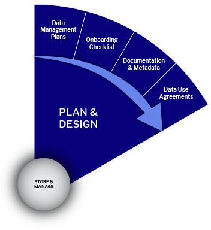

# 🔴 DMP Guide Sheet

## **GUIDE SHEET: Data Management Plans**

## **Data Management Planning**

**The Research Data Lifecycle**\
The research data lifecycle is a framework that illustrates the different stages of managing data throughout a research project, highlighting its progression from initial planning to final reuse. Effective data management requires thoughtful planning and thorough documentation of how data will be collected, organized, stored, and shared.

This lifecycle model breaks down each project phase concerning data, from planning and design, collection and analysis, storage, sharing, and eventual reuse. At its core lies the "Store & Manage" stage, which ensures data integrity, security, and accessibility throughout the project. While the lifecycle is often presented as a linear sequence—from "Plan & Design" to "Access & Reuse"—in practice, researchers frequently move between these stages in a non-linear, iterative manner as their project evolves and new needs arise.

## **Plan and Design Stage**

<figure><figcaption></figcaption></figure>

A Data Management Plan (DMP) is vital for research projects. It is a comprehensive document outlining data handling, security, and sharing throughout and beyond the project. As funding entities and research institutions increasingly demand DMPs, their formality varies from informal internal documents to formal submissions for funding agencies.

DMPs ensure all team members understand data location, organization, documentation, and access procedures. They can be updated as living documents throughout the project. Creating a DMP promotes strategic thinking, collaboration, and consistency among team members while identifying potential weaknesses in the research process.

A well-crafted DMP conserves time, money, and energy by organizing data and planning its management throughout its lifecycle. With many funders now requiring DMPs in their application process, prioritizing their creation is crucial for meeting requirements and ensuring long-term data accessibility, ultimately benefiting the broader research community.

**When thinking about your project:**

* Determine if you need a Data Use Agreement to acquire or share data.
* Develop Documentation and metadata standards for better data discovery.
* Your institution's and funding agency's expectations and policies
* Whether you collect new data or reuse existing data
* The kind of data collected and its format.
* The quantity of data collected.
* Whether versions of the data need to be tracked
* Storage of active data, backup policy, and implementation
* Storage and archiving options and requirements.
* Organizing and describing or labeling the data
* Data access and sharing
* Privacy, consent, intellectual property, and security issues
* Roles and responsibilities for data management on your research team
* Budgeting for data management

\
For more insight into the questions you should ask and answer, check out the [Data Management Checklist (UK Data Archive)](https://bit.ly/3y93BTV)

**Data Management Plans Resources**

* [FAIR Guidance to the Science Europe DMP assessment](https://bit.ly/3HbRMz7)
* [DeiC DMP – Denmark](https://bit.ly/3NZTia4)
* [Data Management Plans | Data Stewardship](https://bit.ly/3b56r3a)
* [Checklist for a Data Management Plan | DCC](https://bit.ly/3NYUkmM)

**Research Data Management Training Resources**

* [Research Data Management - UK Data Archive](https://bit.ly/3xVW3Un)
* [Research and Sharing Data Guide](https://bit.ly/3O1Il7W)
* [Protecting Data for Long-Term Use](https://bit.ly/3QoE6Vs)

**The University of Copenhagen Guides for writing DMP**

* [UCPH Policy on Data Management Planning](https://kunet.ku.dk/work-areas/research/data/Documents/UCPHPolicyforResearchDataManagement2022-EN.pdf)
* [Guidelines on how to fill out a Data Management Plan (DMP)](https://kunet.ku.dk/work-areas/research/data/data-management-plans/Pages/default.aspx)
* [Video for Research Data Management Plans](https://kunet.ku.dk/work-areas/research/data/data-management-plans/Pages/default.aspx)
* [Manual for DMPonline](https://kunet.ku.dk/work-areas/research/data/data-management-plans/Documents/DMPonline%20-%20UCPH%20manual.pdf)
* [Examples of Data Management Plans](https://kunet.ku.dk/work-areas/research/data/data-management-plans/Documents/DMPonline%20-%20UCPH%20manual.pdf)

**European Commission Guidance on DMP**

* [Guidelines on FAIR Data Management in Horizon 2020](https://ec.europa.eu/research/participants/data/ref/h2020/grants_manual/hi/oa_pilot/h2020-hi-oa-data-mgt_en.pdf)
* [Horizon Europe guidelines](https://kunet.ku.dk/work-areas/research/data/data-management-plans/Documents/Guidelines%20for%20Horizon%20Europe's%20data%20management%20plan%20template.pdf)
* [Horizon Europe Template](https://kunet.ku.dk/work-areas/research/data/data-management-plans/Documents/Horizon%20Europe%20DMP%20template.docx)
* [European Research Council Template](https://kunet.ku.dk/work-areas/research/data/data-management-plans/Documents/ERC-Data-Management-Plan.docx)

**Tools for writing DMP**

* [DeiC DMP](https://dmp.deic.dk/)
* [ARGOS](https://argos.openaire.eu/home)
