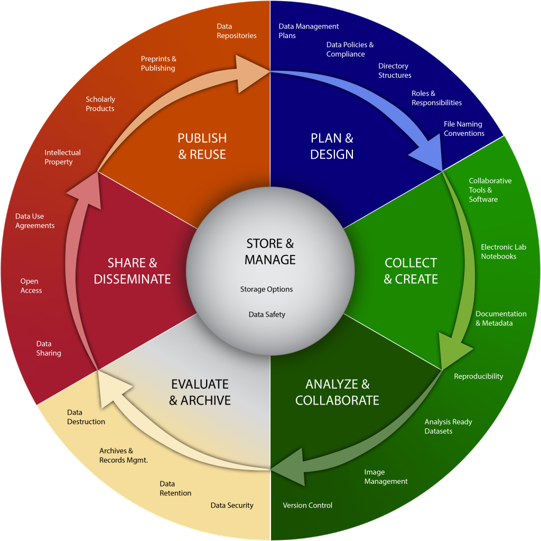

# 🟠 Guide: Research Data Life Cycle&#x20;

<figure><figcaption>
This checklist and Research Data Life Cycle are adapted from <a href="https://datamanagement.hms.harvard.edu/about-rdmwg">the Harvard Medical School Data Management Working Group</a> and are licensed under a <a href="https://creativecommons.org/licenses/by/4.0/">Creative Commons Attribution 4.0 International License</a>. Modified 31 March 2023 by <a href="https://www.linkedin.com/in/pacian/">Richard Dennis</a>, <a href="https://renew.ku.dk">Novo Nordisk Foundation Center for Stem Cell Medicine, University of Copenhagen.</a>
</figcaption></figure>

