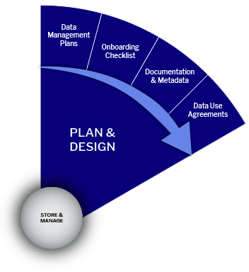

# 🔴 DMP Guide Sheet

<figure><figcaption>
Data Management Plans: Guide Sheet
</figcaption></figure>

## Data Management Planning

### **Understanding the Research Data Lifecycle**

Effective research data management begins with thoughtful planning and continues throughout the entire research lifecycle. The Research Data Lifecycle is a framework that outlines the major stages involved in managing data, from initial planning to final sharing and reuse. It helps researchers organize, safeguard, and share data in a structured and sustainable way.

### The Research Data Lifecycle

The lifecycle typically consists of the following key stages:

* **Plan and Design**\
  Define your data needs, documentation standards, storage solutions, and team responsibilities before data collection begins.
* **Collect and Create**\
  Generate or acquire data using agreed-upon protocols, ensuring accuracy, consistency, and proper documentation.
* **Store and Manage**\
  Ensure data integrity, version control, security, and accessibility throughout the active phase of the research project.
* **Analyze**\
  Process and analyze data while maintaining a structured organization and traceability.
* **Preserve and Archive**\
  Safeguard final datasets for long-term retention using appropriate formats and metadata standards.
* **Share and Publish**\
  Disseminate data through trusted repositories or platforms while considering licensing, access, and ethical obligations.
* **Access and Reuse**\
  Enable future discovery and reuse by ensuring that data is findable, well-described, and appropriately licensed.

**Note: While these stages are often presented as a linear sequence, data management is rarely linear in practice. Researchers often move back and forth between stages as the project evolves.**

### What is a Data Management Plan (DMP)?

A Data Management Plan (DMP) is a formal document that outlines how data will be handled throughout a research project's lifecycle. It describes data collection, storage, documentation, sharing, security, and long-term preservation procedures.

DMPs are increasingly required by funding agencies and research institutions. They can vary in complexity, from internal team documents to formal submissions for external grants. A well-developed DMP is a living document that can be revised as a project progresses.

## Why DMPs Matter

A well-crafted DMP:

* Ensures clear communication and role allocation within the research team
* Enhances the findability, quality, and long-term value of research data
* Promotes data sharing and research transparency
* Helps anticipate and address ethical, legal, and technical challenges
* Conserves time, funding, and effort through proactive planning
* Fulfills institutional and funder requirements (e.g., Horizon Europe, ERC)

By encouraging structured data management, a DMP contributes to research integrity and increases the potential impact of your research outcomes.

## Key Questions to Consider When Writing a DMP

When developing a DMP, consider the following:

* Will you need a Data Use Agreement to obtain or share data?
* What metadata and documentation standards will you follow?
* What are your institution’s and funder’s data management expectations?
* Are you collecting new data or reusing existing data?
* What kind of data will you generate, and in what formats?
* What is the expected volume of data?
* Will you need to track versions of your data?
* What is your storage strategy for active data, and what is your backup policy?
* How will you store and archive data after the project ends?
* How will you organize, name, and describe your data files?
* What are your plans for making the data accessible to others?
* Are there any privacy, consent, security, or intellectual property considerations?
* Who on your team is responsible for each data management task?
* Have you allocated sufficient budget for data management activities?

## Support Available

Support is available if you need guidance on writing your DMP or managing any aspect of your data. Contact Richard Dennis, Data Steward for reNEW—Copenhagen Node, for personalized assistance. In-person consultations are available every Wednesday from 14:00 to 15:00 or by appointment.

## **Data Management Plans Resources**

* [FAIR Guidance to the Science Europe DMP assessment](https://bit.ly/3HbRMz7)
* [DeiC DMP – Denmark](https://bit.ly/3NZTia4)
* [Data Management Plans | Data Stewardship](https://bit.ly/3b56r3a)
* [Checklist for a Data Management Plan | DCC](https://bit.ly/3NYUkmM)

## **Research Data Management Training Resources**

* [Research Data Management - UK Data Archive](https://bit.ly/3xVW3Un)
* [Research and Sharing Data Guide](https://bit.ly/3O1Il7W)
* [Protecting Data for Long-Term Use](https://bit.ly/3QoE6Vs)

## **The University of Copenhagen Guide for writing DMP**

* [UCPH Policy on Data Management Planning](https://kunet.ku.dk/work-areas/research/data/Documents/UCPHPolicyforResearchDataManagement2022-EN.pdf)
* [Guidelines on how to fill out a Data Management Plan (DMP)](https://kunet.ku.dk/work-areas/research/data/data-management-plans/Pages/default.aspx)
* [Video for Research Data Management Plans](https://kunet.ku.dk/work-areas/research/data/data-management-plans/Pages/default.aspx)
* [Manual for DMPonline](https://kunet.ku.dk/work-areas/research/data/data-management-plans/Documents/DMPonline%20-%20UCPH%20manual.pdf)
* [Examples of Data Management Plans](https://kunet.ku.dk/work-areas/research/data/data-management-plans/Documents/DMPonline%20-%20UCPH%20manual.pdf)

## **European Commission Guidance on DMP**

* [Guidelines on FAIR Data Management in Horizon 2020](https://ec.europa.eu/research/participants/data/ref/h2020/grants_manual/hi/oa_pilot/h2020-hi-oa-data-mgt_en.pdf)
* [Horizon Europe guidelines](https://kunet.ku.dk/work-areas/research/data/data-management-plans/Documents/Guidelines%20for%20Horizon%20Europe's%20data%20management%20plan%20template.pdf)
* [Horizon Europe Template](https://kunet.ku.dk/work-areas/research/data/data-management-plans/Documents/Horizon%20Europe%20DMP%20template.docx)
* [European Research Council Template](https://kunet.ku.dk/work-areas/research/data/data-management-plans/Documents/ERC-Data-Management-Plan.docx)

## **Tools for writing DMP**

* [DeiC DMP](https://dmp.deic.dk/)
* [ARGOS](https://argos.openaire.eu/home)
