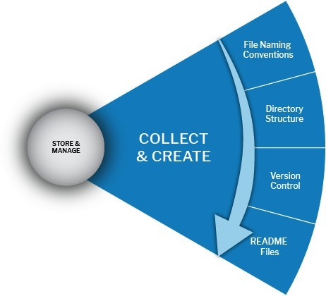

# Collect & Create Stage

<figure><figcaption></figcaption></figure>

### Collect and Create Stage:

When managing data and documents in the Collect and Create Stage within a workgroup, you must implement processes that work best for your team. Defining directory structures and naming conventions are an excellent place to start, even in the middle of a project. Defining structure early in the process provides an organizational foundation for all your data and document files

<table data-header-hidden><thead><tr><th width="208.5"></th><th></th><th data-hidden></th></tr></thead><tbody><tr><td>Project Description</td><td>
Begin by immediately building or locating a detailed <a href="https://ukdataservice.ac.uk/readme_template/">README.txt</a> (see the example provided by UK Data Service) overview of your project.

Content description (brief) of the data that will be collected. Include any value definitions, questionnaires or instruments, or analysis procedures.

Data documentation includes lab notebooks and experimental protocols, questionnaires, codebooks, data dictionaries, software syntax and output files, information about equipment settings and calibration, database schema, methodology reports, and provenance information.
</td><td></td></tr><tr><td>Data Gathering</td><td>
Explain how the data will be collected and/or describe any existing data used (citations, link, and DOI). Create an organizational workflow for the data, detailing any methods, procedures, and/or protocols used.
<ul><li><a href="https://kunet.ku.dk/work-areas/research/units/SUNDs-toolbox/Pages/Acceptable-Use-Policy-for-the-use-of--LabGuru-at-the-Faculty-of-Health-and-Medical-Science.aspx?searchHitHighlight=labguru">Electronic Lab Notebook:</a> ELNs allow users to enter protocols, observations, notes, and other data using a computer or mobile device.</li></ul>
Determine how you will document data collection methods. Create an organizational workflow for the data, detailing any methods, procedures, and/or protocols used.
</td><td></td></tr><tr><td>Data Volume</td><td>Estimate how much data will be produced throughout the project, at what growth rate, and if the production rate will change during the project.</td><td></td></tr><tr><td>Metadata Standards</td><td>Use community standards for sharing and integration. <a href="https://www.dcc.ac.uk/guidance/standards/metadata">Metadata standards </a>include Dublin Core, e-GMS, ISO191152003E- Geo, PREMIS, and MIBBI. Be sure to include all the information needed for the data to be read and interpreted in the future.</td><td></td></tr><tr><td>Metadata Catalog, Data Dictionary, or README</td><td>Create a Metadata Catalog, Data dictionary, or <a href="https://ukdataservice.ac.uk/readme_template/">README files</a> that define variables, measurement units, formats, and data types. Ensure data quality and integrity during collection by creating training documentation that includes the data dictionary, establishing a shared understanding of what is collected or recorded and why, and documenting data decisions (ex., raw vs. compound variables; age vs. DOB).</td><td></td></tr><tr><td>Code Documentation</td><td>Establish documentation for code, scripts, and software (revise as the project continues). Include descriptive comments within code or scripts to explain what it is doing. Record scripts for every Stage of data processing and/or have a plan to document every manual action/change.</td><td></td></tr><tr><td>Data Organization</td><td>
Establish rules for data organization. Describe your file naming/folder structure. Research data files and folders need to be labeled and organized in a systematic way agreed upon by the entire research team. Hence, they are both identifiable and accessible to current and future users. Team consensus/agreement to use standard file naming conventions and versioning plans.  

●      Will someone new to the project be able to follow the workflow easily?

●      Are the process and organization consistent throughout?

 
<ul><li>File Naming: Be consistent and use descriptive names (ex. 20190112-RawData-Smith)</li><li>File Structure: Create folders according to File naming conventions, document their purpose, and ensure files are stored in the correct folders.</li><li>Versioning: Establish naming and storage rules for different versions of the same data. Versioning control can be achieved manually or with a system (e.g., Git)</li><li>Data Inventory: Track data files using a simple spreadsheet/database/ collaborative tool.</li></ul></td><td></td></tr></tbody></table>
