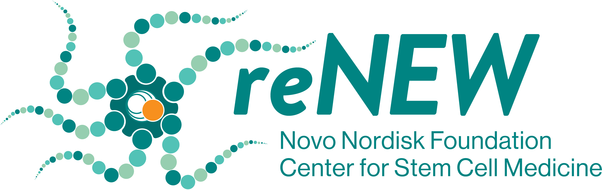

# 🔘 Welcome to reNEW Data Champions

<figure><figcaption>
Novo Nordisk Foundation Center for Stem Cell Medicine - reNEW
</figcaption></figure>


The resources and guides have been meticulously curated to support and enhance the Data Champion Program at reNEW. The accompanying infographics and insights will help your learning process. This website is undergoing updates and modifications, ensuring it remains relevant and reflects the most recent information and policy changes. We encourage you to visit the website regularly to stay informed about these updates.

Should you wish to use these materials in your work or research, we kindly ask that you attribute them correctly by citing the respective author. To preserve the integrity of the content, please refrain from modifying the infographics.

Your feedback is integral to the ongoing development of these resources. We warmly invite you to share any comments or suggestions as we regularly update and add new content to the website.

We appreciate your adherence to these guidelines and hope that the materials serve as a helpful tool in your pursuit of knowledge.



Research Data Management Infographic Series: by [Richard Dennis](mailto:richard.dennis@sund.ku.dk) - [NNF Center for Stem Cell Medicine - reNEW - Data Champion Program, University of Copenhagen.](https://renew.ku.dk/) Licensed under a [Creative Commons Attribution–Non–Commercial–No Derivates 4.0 International License.](https://creativecommons.org/licenses/by-nc-nd/4.0/)

Research Data Management Guides and Documents: by [Richard Dennis](mailto:richard.dennis@sund.ku.dk) - [NNF Center for Stem Cell Medicine - reNEW - Data Champion Program, University of Copenhagen.](https://renew.ku.dk/) Licensed under a [Creative Commons Attribution–Non–Commercial–No Derivates 4.0 International License.](https://creativecommons.org/licenses/by-nc-nd/4.0/)

