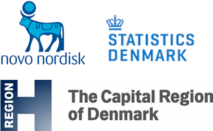

# Open Science in HE

"Open Science is the movement to make scientific research, data, and dissemination accessible to  all levels of an inquiring society.“

The Open Science Training Handbook [http://book.fosteropenscience.eu/en/](http://book.fosteropenscience.eu/en/)  At UCPH, Open Science is based on these seven pillars \*[^1]:

<figure><figcaption></figcaption></figure>

**"Open Science is the movement to make scientific research, data, and dissemination accessible to all levels of an inquiring society.“**

The Open Science Training Handbook [http://book.fosteropenscience.eu/en/](http://book.fosteropenscience.eu/en/)

* Open Science applies to **all disciplines** (“Open Research,” “Open Scholarship”)
* Open Science implies public open access to scientific information
  * For other researchers as well as corporate and private users
  * **Free of charge**
* Open Science comprises **principles** and **practices**
* transparency, re-use, participation, cooperation, accountability, and reproducibility for research
* Data sharing, open notebooks, transparency in research evaluation, open-source code, software and infrastructure, citizen science, and open educational resources

### Open Science in Horizon Europe



<figure><figcaption></figcaption></figure>

<figure><figcaption></figcaption></figure>

* Open Access to research outputs such as publications, data, software, models, algorithms, and workflows
* Early and Open Sharing of research, for example, through preregistration, registered reports, pre-prints, and crowd-sourcing solutions to a specific problem.
* Use of Open Research Infrastructures for knowledge and data sharing
* Participation in Open Peer-Review
* Open Collaboration within science and with other knowledge actors involving citizens, civil society, and end-users, such as citizen science.
* Measure to ensure the reproducibility of results

### Horizon Europe (HORIZON) – Programme Guide

[https://ec.europa.eu/info/funding-tenders/opportunities/docs/2021-2027/horizon/guidance/programme-guide\_horizon\_en.pdf](https://ec.europa.eu/info/funding-tenders/opportunities/docs/2021-2027/horizon/guidance/programme-guide\_horizon\_en.pdf)

### EU Grants AGA – Annotated Model Grant Agreement

[https://ec.europa.eu/info/funding-tenders/opportunities/docs/2021-2027/common/guidance/aga\_en.pdf](https://ec.europa.eu/info/funding-tenders/opportunities/docs/2021-2027/common/guidance/aga\_en.pdf)

[^1]: LERU - League of European Research Universities is a consortium of European research universities.
