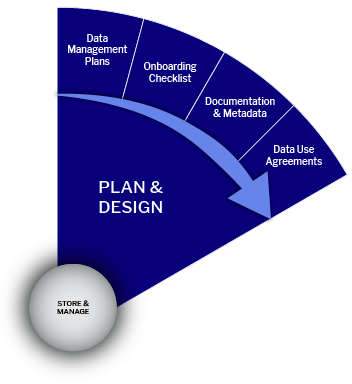

# Data Management Planning

## Data Management Planning

<figure><figcaption></figcaption></figure>

**A Data Management Plan (DMP**) is vital for research projects, serving as a comprehensive document outlining data handling, security, and sharing throughout and beyond the project. As funding entities and research institutions increasingly demand DMPs, their formality varies from informal internal documents to formal submissions for funding agencies.

DMPs ensure all team members understand data location, organization, documentation, and access procedures, and they can be updated as living documents throughout the project. Creating a DMP promotes strategic thinking, collaboration, and consistency among team members while identifying potential weaknesses in the research process.

A well-crafted DMP conserves time, money, and energy by organizing data and planning its management throughout its lifecycle. With many funders now requiring DMPs in their application process, prioritizing their creation is crucial for meeting requirements and ensuring long-term data accessibility, ultimately benefiting the broader research community.

## What is Research Data Management?

**Research Data Management (RDM)** is an ongoing, iterative process where early-stage decisions impact subsequent actions. Managing data effectively throughout the project is generally more efficient than reconstructing everything retrospectively. RDM includes daily management of research data during a project's duration (e.g., employing consistent file naming conventions) and determining how data will be preserved and shared post-project (e.g., depositing data in a repository for long-term archiving and access).

## Why is Research Data Management important?

There are a host of reasons why research data management is essential:

* Data (primarily digital data) is fragile and easily lost.
* There are growing research data requirements imposed by funders and publishers.
* Research data management saves time and resources overall.
* Good governance helps to prevent errors and increases the quality of your analyses.
* Well-managed and accessible data allows others to validate and replicate findings.
* Research data management facilitates sharing of research data, and when shared, data can lead to valuable discoveries by others outside of the original research team.

## When thinking about your project:

* Determine if you need a Data Use Agreement to acquire or share data.
* Develop Documentation & Metadata standards for better data discovery.
* Your institution's and funding agency's expectations and policies
* Whether you collect new data or reuse existing data
* The kind of data collected and its format.
* The quantity of data collected.
* Whether versions of the data need to be tracked
* Storage of active data and backup policy and implementation
* Storage and archiving options and requirements.
* Organizing and describing or labeling the data
* Data access and sharing
* Privacy, consent, intellectual property, and security issues
* Roles and responsibilities for data management on your research team
* Budgeting for data management

For more insight into the questions you should ask and answer, check out [**Data Management Checklist (UK Data Archive)**](https://bit.ly/3y93BTV)

## Plan and Design Resources:  Data Management Plans:

### Guides for Research Data Management:

<table data-header-hidden><thead><tr><th></th><th></th><th data-hidden></th></tr></thead><tbody><tr><td><a href="https://bit.ly/reNEWDOCS">https://bit.ly/reNEWDOCS</a></td><td>reNEW Research Data Management Guidance</td><td></td></tr><tr><td><a href="https://bit.ly/3xVW3Un">https://bit.ly/3xVW3Un</a></td><td>Research Data Management - UK Data Archive</td><td></td></tr><tr><td><a href="https://bit.ly/3O1Il7W">https://bit.ly/3O1Il7W</a></td><td>Research and Sharing Data Guide</td><td></td></tr><tr><td><a href="https://bit.ly/3QoE6Vs">https://bit.ly/3QoE6Vs</a></td><td>Protecting Data for Long-Term Use</td><td></td></tr></tbody></table>

### Data Management Plans (DMP):

<table data-header-hidden><thead><tr><th></th><th></th><th data-hidden></th></tr></thead><tbody><tr><td><a href="https://bit.ly/3HbRMz7">https://bit.ly/3HbRMz7</a></td><td>FAIR Guidance - Science Europe DMP Rubric</td><td></td></tr><tr><td><a href="https://bit.ly/3NU4Xak">https://bit.ly/3NU4Xak</a></td><td>DMP Tool from CDL</td><td></td></tr><tr><td><a href="https://bit.ly/ARGOSDMP">https://bit.ly/ARGOSDMP</a></td><td>ARGOS – machine-actionable DMP</td><td></td></tr><tr><td><a href="https://bit.ly/3NZTia4">https://bit.ly/3NZTia4</a></td><td>DMPonline – UCPH</td><td></td></tr><tr><td><a href="https://bit.ly/3b56r3a">https://bit.ly/3b56r3a</a></td><td>Data Management Plans | Data Stewardship</td><td></td></tr><tr><td><a href="https://bit.ly/3NYUkmM">https://bit.ly/3NYUkmM</a></td><td>Checklist for a Data Management Plan | DCC</td><td></td></tr></tbody></table>

### The University of Copenhagen Guides for Writing DMP:

<table data-header-hidden><thead><tr><th></th><th></th><th data-hidden></th></tr></thead><tbody><tr><td><a href="https://bit.ly/UCPHRDM">https://bit.ly/UCPHRDM </a></td><td>UCPH Policy on Data Management Planning</td><td></td></tr><tr><td><a href="https://bit.ly/UCPHDMP">https://bit.ly/UCPHDMP  </a></td><td>Guidelines - Data Management Plan (DMP)</td><td></td></tr><tr><td><a href="https://bit.ly/DeiCVideoRDM">https://bit.ly/DeiCVideoRDM</a></td><td>eLearning for Research Data Management Plan</td><td></td></tr><tr><td><a href="https://bit.ly/UCPHDMPOnline">https://bit.ly/UCPHDMPOnline</a></td><td>Manual for DMPonline</td><td></td></tr><tr><td><a href="https://bit.ly/UCPHDMPTemplate">ttps://bit.ly/UCPHDMPTemplate</a></td><td>UCPH Data Management Plan Template</td><td></td></tr></tbody></table>

### Science Europe:

<table data-header-hidden><thead><tr><th></th><th></th><th data-hidden></th></tr></thead><tbody><tr><td><a href="https://bit.ly/SEDMPGUIDE">https://bit.ly/SEDMPGUIDE</a></td><td>Science Europe - DMP evaluation guide</td><td></td></tr><tr><td><a href="https://bit.ly/SETEMPLATE">https://bit.ly/SETEMPLATE</a></td><td>Science Europe - DMP Template</td><td></td></tr></tbody></table>

### European Commission:

<table data-header-hidden><thead><tr><th></th><th></th><th data-hidden></th></tr></thead><tbody><tr><td><a href="https://bit.ly/HEGUIDES2020">https://bit.ly/HEGUIDES2020</a></td><td>Horizon 2020 Guidelines</td><td></td></tr><tr><td><a href="https://bit.ly/HE2022GUIDES">https://bit.ly/HE2022GUIDES</a></td><td>Horizon Europe Guidelines</td><td></td></tr><tr><td><a href="https://bit.ly/ERCTEMP">https://bit.ly/ERCTEMP</a></td><td>European Research Council Template</td><td></td></tr></tbody></table>
