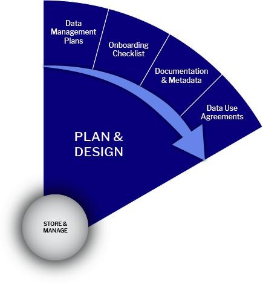

# Plan & Design Stage

<figure><figcaption>
Plan &#x26; Design Stage
</figcaption></figure>

## **Plan & Design Stage – Summary Table**

| **Category**                       | **Details & Best Practices (UCPH · reNEW · EU Funders)**                                                                                                                                                                                                                                       |
| ---------------------------------- | ---------------------------------------------------------------------------------------------------------------------------------------------------------------------------------------------------------------------------------------------------------------------------------------------- |
| **Stage Purpose**                  | Define what data will be collected, created, or reused and how it will be managed across the research lifecycle. Establish a Data Management Plan (DMP) as both a planning tool and a compliance document.                                                                                     |
| **Key Output**                     | Data Management Plan (DMP) – living document that captures:• Data to be collected/created/reused• Storage and backup strategy• Access permissions and roles• Metadata and documentation plan• Compliance with GDPR and funder policies                                                         |
| **Funders & Policy Drivers**       | <ol><li>Horizon Europe/ERC: requires a formal DMP submission (for the first 6–12 months of the project).</li><li>Danish funders increasingly encourage DMPs aligned with FAIR and Open Science principles.- UCPH &#x26; reNEW: Follow institutional Research Data Management Policy.</li></ol> |
| **Internal UCPH / reNEW Practice** | <ol><li>Recommended for all projects, even without funder mandates.</li><li>DMPs should integrate UCPH-approved storage solutions (ERDA, REDCap, secure storage).</li><li>Define handling of sensitive/personal data under GDPR.</li></ol>                                                     |
| **Team Awareness Requirements**    | 
All team members should know:

1. Where the data is stored, including backups

2. Who can access the data, and how (authentication/permissions)

3. How data is organized and documented, including folder structures, file naming, metadata, and README files
           |
| **Living Document Approach**       | <ol><li>Update DMP regularly as the project evolves (new data, new collaborators, changing funder requirements).</li><li>Maintain traceability and compliance throughout the project lifecycle.</li><li>Supports secure storage, data quality, and eventual open sharing.</li></ol>            |
| **Benefits**                       | <ol><li>Ensures regulatory and funder compliance.</li><li>Supports data security and research integrity.</li><li>Enables future discoverability, reuse, and alignment with Open Science.</li><li>Provides a clear operational guide for all project members.</li></ol>                         |
| **Roles & Responsibilities**       | PI: Approves the DMP and ensures resources and compliance.Data Steward/Manager: Drafts and maintains DMP, ensures FAIR alignment, and manages updates.Team Members: Follow DMP procedures for data collection, storage, and documentation.                                                     |
| **Common Risks & Mitigations**     | Risk: DMP becomes static → Mitigation: Schedule regular reviews.Risk: Sensitive data mishandled → Mitigation: Define GDPR procedures and storage controls.Risk: Non‑FAIR structure → Mitigation: Use metadata templates and standard folder structures.                                        |

