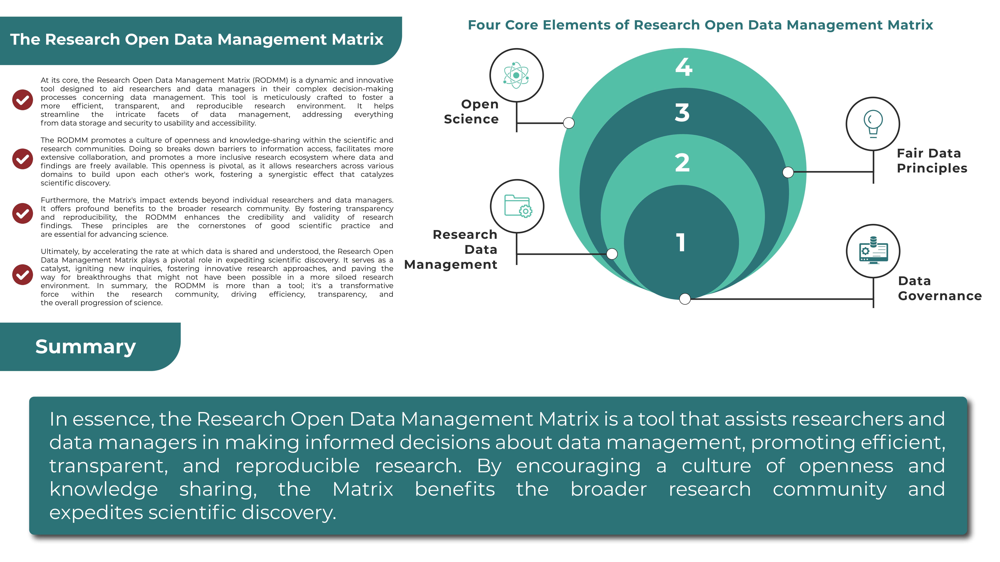
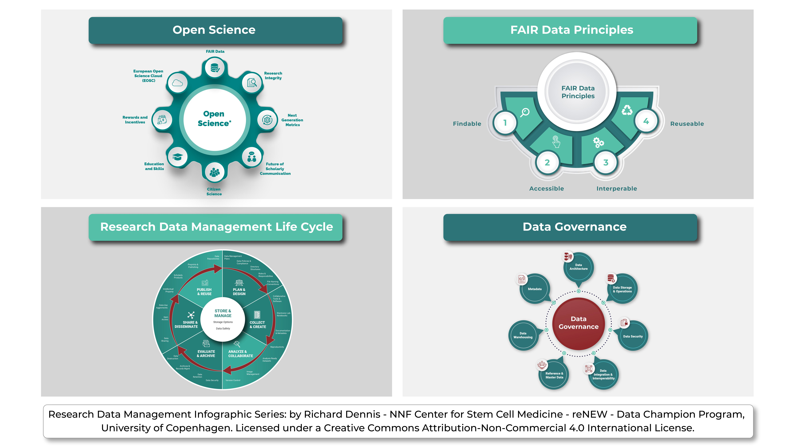

# 🔴 RODMM Framework

## **The Research Open Data Management Matrix**

This matrix introduces researchers to the essential and interconnected concepts of **Open Science**, **Research Data Management (RDM)**, the **FAIR Principles**, and **Data Governance**. These concepts are often presented in isolation, leaving researchers unclear about how they relate. This matrix is designed to bridge that gap by showing their interdependencies clearly and in a structured.

The **Research Open Data Management Matrix** is a comprehensive framework that supports effective data management across the entire research data lifecycle, fully aligned with **Open Science** and **FAIR** (Findable, Accessible, Interoperable, and Reusable) principles.

Structured around the key stages of the data lifecycle—**collection, processing, analysis, preservation, and sharing**—the Matrix offers **practical, actionable guidance** at each step to help ensure data remains FAIR. It emphasizes open data practices, promoting broad and unrestricted access to research data so it can be reused and repurposed by the wider scientific community.

A central feature of the Matrix is its **focus on robust data governance**. This includes developing and enforcing policies, procedures, and standards that ensure data quality, privacy, security, and regulatory compliance. Strong governance safeguards the production of accurate, reliable, and ethically managed data, building **trust and accountability** in the research process.

The **Research Open Data Management Matrix** is essential for researchers and data managers. Enabling informed decision-making throughout the data lifecycle promotes **efficient, transparent, and reproducible research**. This, in turn, cultivates a culture of openness and collaboration, advancing scientific discovery and delivering lasting benefits to the global research community.

<figure><figcaption>
Research Open Data Management Matrix (RODMM)
</figcaption></figure>

<figure><figcaption>
Research Open Data Management Matrix (RODMM)
</figcaption></figure>

