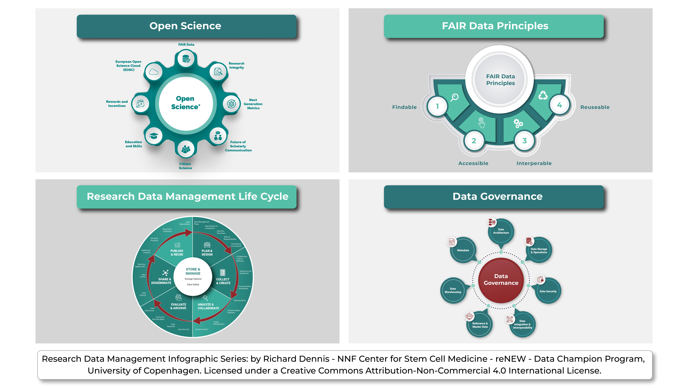

# 🟢 Research Open Data Management Matrix

\
The Research Open Data Management Matrix is a comprehensive framework designed to guide the handling of research data throughout its lifecycle in alignment with Open Science and FAIR principles. It is organized around the data lifecycle stages and critical data management principles.

At each data lifecycle stage - collection, processing, analysis, preservation, and sharing - the Matrix guides ensure data is Findable, Accessible, Interoperable, and Reusable (FAIR). It promotes open data practices, advocating for free and open access to research data, which others can use and reuse.

The Matrix also underscores the importance of robust data governance, which involves developing and implementing policies, practices, and procedures to ensure high data quality, privacy, security, and regulatory compliance. This results in accurate, reliable, and responsibly managed data, fostering trust and accountability in research processes and outcomes.

In essence, the Research Open Data Management Matrix is a tool that assists researchers and data managers in making informed decisions about data management, promoting efficient, transparent, and reproducible research. By encouraging a culture of openness and knowledge sharing, the Matrix benefits the broader research community and expedites scientific discovery.

<figure><figcaption>
Research Open Data Management Matrix (RODMM)
</figcaption></figure>

<figure><figcaption>
Research Open Data Management Matrix (RODMM)
</figcaption></figure>

