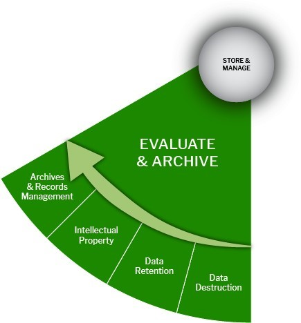

# 🟢 Evaluate & Archive Stage

<figure><figcaption></figcaption></figure>

## Evaluate and Archive Stage:

The fourth Stage of data management is archiving. Data archiving is " identifying and moving inactive data out of current production systems and into specialized long-term archival storage systems." This serves two objectives: 1) moving inactive data out of active systems and databases to optimize current performance, and 2) storing static data in specialized archival systems that are more cost-effective and allow for retrieval when needed. A data archive may also be called a data vault.&#x20;

Permanent retention, or archiving, implies ongoing migration of electronic formats and storage costs, as well as care, maintenance, and access services for the records in perpetuity. This differs from ensuring long-term storage or preservation of research data and takes significant investment for a faculty.

Long-term storage and preservation ensure that research data will be available to those seeking it in a persistent and accessible format for the specific period outlined by your funder and parent faculty. These Data Retention periods also allow for a measured period to pass so that a better assessment of the long-term impact of a research project can be evaluated.

<table data-header-hidden><thead><tr><th width="186.5"></th><th></th><th data-hidden></th></tr></thead><tbody><tr><td>Data Appraisal</td><td>
A small percentage of data and related records might be identified for permanent storage as part of a discipline or faculty's historical record or intellectual property. Records eligible for permanent retention may be those that:  

●      Document a breakthrough

●      are generated by a lab or individual who had a significant impact on the field

●      <a href="https://kunet.ku.dk/work-areas/research/data/data-preservation/executive-order/Pages/default.aspx">are highly reusable in a particular area of research.</a>
<ul><li>What must data be retained/destroyed for contractual, legal, or regulatory purposes?</li><li>How long will the data be kept and preserved?</li></ul></td><td></td></tr><tr><td>Ownership</td><td>
<a href="https://kunet.ku.dk/work-areas/research/data/Documents/UCPHPolicyforResearchDataManagement2022-EN.pdf">Refer to the section on Rights to research data of the UCPH Policy for Research Data Management: Section 2.2</a>

To effectively share data, researchers should first resolve any data ownership issues.
<ul><li>Who owns the data (PI/faculty/funder/other)?</li><li>What records are you allowed to take if you move to a new faculty?</li></ul></td><td></td></tr><tr><td></td><td>
<a href="https://kunet.ku.dk/work-areas/research/data/Documents/UCPHPolicyforResearchDataManagement2022-EN.pdf">Refer to the section on Rights to research data of the UCPH Policy for Research Data Management: Section 2.2 and 2.2.2</a>

<a href="https://fi.ku.dk/english/tech_trans/">Copyright/Intellectual Property Rights (IPR)</a>

Raw data are considered facts and thus cannot be copyrighted. However, data gathered uniquely and originally, such as databases, can be copyrighted or licensed. It is essential to understand data licensing from the perspective of both the data user and the data creator.
<ul><li>If used, are there any restrictions on reusing third-party data?</li><li>Who will own the copyright and IPR of any data you collect or create, along with the license(s) for its use and reuse? (IPR ownership may be worth covering in a consortium agreement for multi-partner projects. Consider any relevant funder, faculty, departmental, or group policies on copyright or IPR)</li></ul>
<a href="https://fi.ku.dk/english/tech_trans/">Intellectual Property </a>(IP) refers to diverse types of intangible expressions (such as artistic and literary work, discoveries and inventions, words, symbols, and designs) for which specific monopoly rights are recognized under laws<em>.</em>
</td><td></td></tr><tr><td>Storage</td><td>
Long-term storage and preservation ensure that research data will be available to those who seek it in a persistent and accessible format for the specific period outlined by your funder and parent faculty. These data retention periods also allow for a measured period to pass so that a better assessment of the long-term impact of a research project can be evaluated.
<ul><li><a href="https://kunet.ku.dk/work-areas/research/data/data-preservation/Pages/default.aspx">Data Preservation</a>: Research records should be retained for at least five (5) years after a research project or activity ends.</li></ul></td><td></td></tr><tr><td>Archiving Data</td><td>
Permanent retention, or archiving, is often a significant investment for a faculty, as it implies ongoing migration of electronic formats and storage costs, as well as care, maintenance, and access services for the records in perpetuity. This is different from ensuring long-term storage or preservation of research data.
<ul><li>What is the foreseeable research uses for the data?</li><li>What essential records are required to understand this research data and project?</li><li>Is the research data replicable?</li><li>Has the research been published?</li></ul></td><td></td></tr><tr><td>Data Disposal</td><td>
Determining which data and records are safe to dispose of can be complicated. Two online resources may help you understand what is required:  

●         <a href="https://kunet.ku.dk/work-areas/research/data/data-preservation/executive-order/Pages/default.aspx">Reporting of Research Data to the National Archives</a>

●         <a href="https://kunet.ku.dk/work-areas/research/data/Documents/UCPHPolicyforResearchDataManagement2022-EN.pdf">UCPH Policy on Research Data Management</a>

<ul><li> How will you permanently remove sensitive data/project data?</li></ul></td><td></td></tr><tr><td>Services</td><td>For more information regarding good Research Data Management processes, contact <a href="mailto:richard.dennis@sund.ku.dk">richard.dennis@sund.ku.dk</a></td><td></td></tr></tbody></table>
