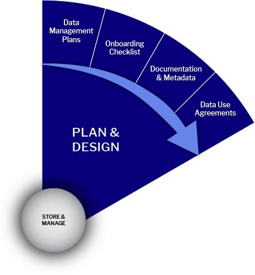

# ⚫ Plan & Design Stage

<figure><figcaption></figcaption></figure>

## Create a Data Management PlanCreate a Data Management PlanPlan & Design Stage:

Here you will identify the data collected or used to answer your research question and plan for data management throughout the lifecycle. This is the Stage at which a data management plan would be created. Many public funders of research ask for a data management plan to be submitted as part of a research application. A DMP might be informal, used internally, or guided by [UCPH policies](https://kunet.ku.dk/work-areas/research/data/Documents/UCPHPolicyforResearchDataManagement2022-EN.pdf) established by the head of a research lab, collaborators, or IT groups across your faculty. Some funding agencies or projects might require the submission of formal DMPs.

During a project, everyone on the research team should know where the data reside, how to access them, and how they are organized and documented so they are readily usable by the team. DMPs can be updated and revised during the project - a DMP is a living document.

<table data-header-hidden><thead><tr><th width="179.5"></th><th></th><th data-hidden></th></tr></thead><tbody><tr><td>Create a Data Management Plan</td><td>
<a href="https://kunet.ku.dk/work-areas/research/data/Documents/UCPHPolicyforResearchDataManagement2022-EN.pdf">Refer to the Data Management Plans and Rights to research data: Section 2.1</a> and 2.2

According to the <a href="https://kunet.ku.dk/work-areas/research/data/data-management-plans/Pages/default.aspx#collapseMSOZoneCell_WebPartWPQ13">UCPH Policy on Data Management Planning</a>, researchers at the University of Copenhagen must plan their research using a DMP. The University has made a <a href="https://kunet.ku.dk/work-areas/research/data/data-management-plans/Documents/UCPH%20Data%20Management%20Plan%20Template_V1.docx">DMP template</a> available that can be used, but researchers can also opt to use other templates.

A data management plan, or DMP (sometimes called a data sharing plan), is a formal document that outlines what you will do with your data during and after a research project.

Your <a href="https://kunet.ku.dk/work-areas/research/data/data-management-plans/Pages/default.aspx">Data Management Plan </a>(DMP) document should describe the final dataset formats, documentation, analytic tools necessary to use the data, data sharing agreements, and how and when the data will be accessible to others.

<a href="https://dmponline.deic.dk/">DMPonline</a> is an online tool available to help you create and share your data management plans to meet funder and faculty requirements and as a best practice for managing your data.

DMPOnline contains the UCPH DMP templates and the Horizon Europe DMP template.
</td><td></td></tr><tr><td>Review Relevant Policies</td><td>
<a href="https://kunet.ku.dk/work-areas/research/data/Documents/UCPHPolicyforResearchDataManagement2022-EN.pdf">Refer to the UCPH Policy for Research Data Management: Section 2.3 through 2.7</a>

Funders, universities, and publishers have expectations and requirements for research data related to security, sharing, and retention.
<ul><li><a href="https://informationssikkerhed.ku.dk/english/is-policy/">Information Security Policy:</a> Describes the basic information security principles that must be adhered to by everyone at the University. It also describes UCPH’s organization concerning information security.</li><li><a href="https://kunet.ku.dk/work-areas/research/data/data-sharing/Pages/default.aspx">Data Sharing</a>: UCPHs requirements for data sharing and preservation are captured in UCPHs policy for research data management.</li><li><a href="https://kunet.ku.dk/work-areas/research/data/data-preservation/Pages/default.aspx#collapseMSOZoneCell_WebPartWPQ8">Long-term preservation:</a> UCPHs data sharing and preservation requirements are captured in UCPHs policy for research data management and the requirement for reporting to the <a href="https://kunet.ku.dk/work-areas/research/data/data-preservation/executive-order/Pages/default.aspx">Danish National Archives</a>.</li></ul></td><td></td></tr><tr><td>Project ID</td><td>
Determined by the funder and/or faculty.

Having the project ID or grant number is essential to understand the applicable policies, specifically data retention periods, to align with the end of a research project or activity.
</td><td></td></tr><tr><td>Project Name</td><td>As it appears exactly as on the grant. Append to grant proposal.</td><td></td></tr><tr><td>Project PI</td><td>
Name of Principal Investigator(s) or primary researcher(s) on the project, including their ORCID. Add ORCID identifiers to your CURIS profile.

<a href="http://orcid.org/">ORCiD</a> is an alphanumeric code uniquely identifying scientific and other academic authors and contributors. 
</td><td></td></tr><tr><td>Resources planning</td><td>
Include any costs for data management services (external data storage). Include any fees for managing data during the project as well as after the project is complete.

Data management is an eligible cost in the project budget (at the proposal phase). Estimate any expense related to the data management services. (Hardware, Software, Human resources, Publication costs, etc.). Research Data Management
</td><td></td></tr><tr><td>Project Description</td><td>
Provide background/rationale about the project.
<ul><li>What research question(s) are you addressing?</li><li>Summarize the study methods and design, including data collection method(s) and purpose of collection.</li><li>How will you ensure its safe transfer into your central secured systems if creating or collecting data in the field?</li></ul></td><td></td></tr><tr><td>Define Roles and Responsibilities</td><td>
<a href="https://kunet.ku.dk/work-areas/research/data/Documents/UCPHPolicyforResearchDataManagement2022-EN.pdf">Refer to Roles and Responsibilities of the UCPH Policy for Research Data Management: Section 3</a>

List staff/organizational roles and responsibilities for the data management plan. Include a description of time allocations, training requirements, and contributions of non-project staff, as appropriate. Assign one or more people to the following roles:
<ul><li>Checklist Manager: Monitors and updates checklist to ensure completion; assigns an “owner” to each checklist item to ensure its completion.</li><li>DMP Manager: Document changes, progress, &#x26; accomplishments.</li><li>Data Workflows Manager: Monitors and documents data workflows and files</li></ul>
UCPH acknowledges the importance of ensuring that all research data are well managed so that they are secure, accessible, and reusable where appropriate and that ethical, confidentiality, privacy, and data protection requirements are respected. This responsibility is shared between various parties. Please refer to the roles in the policy for more details on roles and responsibilities.
</td><td></td></tr><tr><td>Provide Training</td><td>
Provide training for people in these roles and document any data-related training, especially training required for sensitive data handling. See the Onboarding Checklist (in development) for specifics.

The onboarding Checklist (in development) outlines the essential steps for onboarding new employees or trainees to a lab or new projects. RDM is critical for responsible research and should be introduced when starting a new project or joining a new lab.
</td><td></td></tr></tbody></table>

