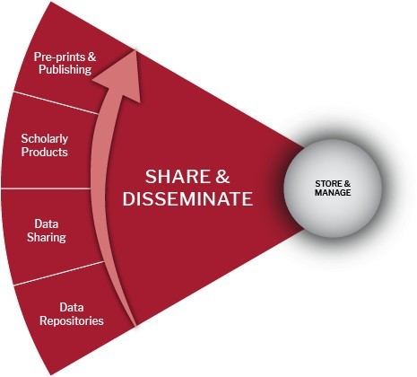

# 🟡 Share & Disseminate Share

<figure><figcaption></figcaption></figure>

### Share & Disseminate Share:

Data sharing is essential for the expedited translation of research results into knowledge, products, and procedures to improve human health.

In the last decade, researchers have become increasingly common to make their data available to others when they complete a study. This is usually referred to as data sharing or data publishing. Data sharing is growing primarily due to journal and funders' current policies.

Publications based on data should include a data citation or a statement indicating where and on what terms the data can be accessed. A data repository will enable the discovery of the data in its care by exposing the metadata online and providing access to it when permitted. Data may be made publicly available, or restrictions on access may be imposed where data are of a sensitive or confidential nature. Data held locally or in non-public locations should be managed so that others can discover and apply for access to the data.

<table data-header-hidden><thead><tr><th width="201.5"></th><th></th><th data-hidden></th></tr></thead><tbody><tr><td>Grant or Contract Data Sharing Requirements</td><td>
<a href="https://kunet.ku.dk/work-areas/research/data/Documents/UCPHPolicyforResearchDataManagement2022-EN.pdf">Refer to the section on Data sharing of the UCPH Policy for Research Data Management: Section 2.6.2</a>
<ul><li>Data Sharing Policy: By default, research data should be made openly available after the project end, as a minimum for data sets underlying research publications. Concerns relating to intellectual property rights, personal data protection, information security, commercial and national interests, and legislation must be considered in accordance with the principle of ‘as open as possible, as closed as necessary. If the research data cannot be made available, sharing the metadata associated with the research data should be considered.</li><li>Does the sponsor or contract have any requirements?</li></ul></td><td></td></tr><tr><td>Data Availability at Publication</td><td>
Many journals and the <a href="https://kunet.ku.dk/work-areas/research/rcr/Code%20of%20Conduct/Pages/default.aspx">UCPH Code of Conduct Research Integrity</a> require that the underlying research data accompany published articles. A data availability statement indicates where the research data associated with a paper is available and under what conditions the data can be accessed. Sometimes this is part of a more significant checklist that requests considerable detail on methodology and metadata and may also include links to the dataset.
<ul><li>Describe how others might find your data (i.e., discipline-specific repository, proprietary repository)</li><li>Submit data (and relevant code) to a reputable DOI issuing repository.</li></ul></td><td></td></tr><tr><td>Data Accessibility</td><td>
Data accessibility is the degree to which other researchers, and you can use data. Data is not just available but also usable. Make your data accessible by ensuring it:  

●      is in a reliable storage location, such as a repository

●      is retrievable online using standardized protocols

●      has restrictions in place if necessary
<ul><li>Identify potential users of the project data.</li><li>Describe how data files will be delivered when requested/accessed.</li></ul></td><td></td></tr><tr><td>Selecting a repository</td><td>
Repositories are databases containing well-described and well-documented research data datasets. <a href="https://kunet.ku.dk/work-areas/research/data/data-sharing/Pages/default.aspx">Data repositories </a> <a href="https://www.re3data.org/faq">(re3data FAQ)</a> are centralized places to hold data, make data available for use, and logically organize data. A good repository will help make your data more valuable for current and future research.

It would be best if you were looking for a repository that does the following:  

●     Stores the data safely

●     Make sure the data is findable

●     Describes the data appropriately (metadata)

●     Adds license information  You can deposit data to a general repository (like Zenodo or UCPH Dataverse) or a subject-specific repository (like GEO or Dryad). When choosing a repository, review the following:
<ul><li>Which repository or archive will the data be held in?</li><li>What costs will your selected data repository or archive charge, if any?</li><li>Does the repository support the creation of unique data citations/DOIs?</li></ul>
 (<a href="https://www.force11.org/group/joint-declaration-data-citation-principles-final">https://www.force11.org/group/joint-declaration-data-citation-principles-final</a>)
<ul><li>Does it host your file format?</li><li>Is there a size limit per File?</li><li>Is there a size limit for the total dataset?  </li><li>Who can find and access deposited data?</li><li>Is there journal-integrated, anonymous access (for peer review pre-publication)?</li><li>Are there tiered access roles and settings?</li><li>Is there an optional embargo for data release following publication?  </li><li>Is there data access via direct download? API?</li><li>Are there built-in tools to read proprietary file formats? </li><li>Are there integrated data analysis tools?</li><li>Are there comprehensive data and metadata search tools available?</li><li>Have you planned the cost, time, and effort to prepare the data for sharing/preservation?</li></ul></td><td></td></tr></tbody></table>
