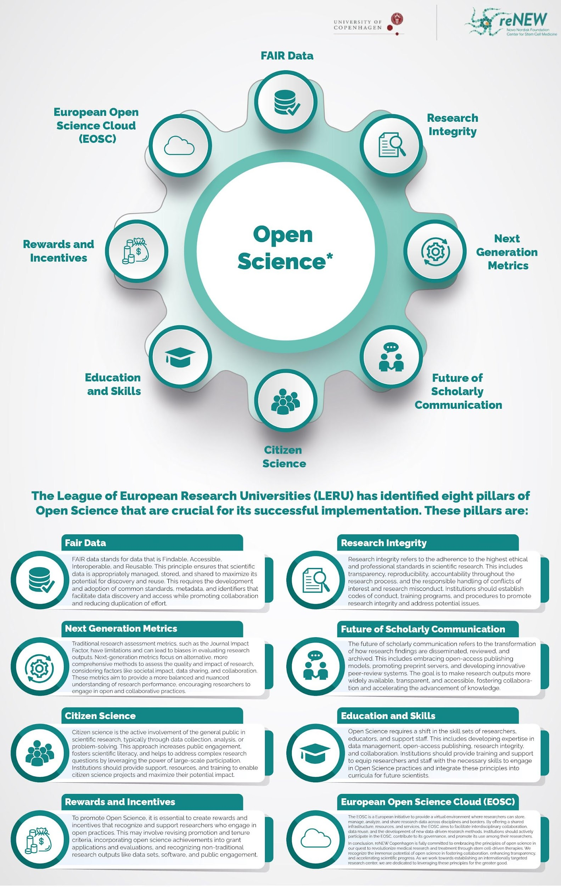

# Guide for Data Processing and Analysis

## **Analyze and Collaborate Stage**

The **"Analyze and Collaborate"** data management phase focuses on scrutinizing, cleansing, transforming, and modeling data to glean valuable insights, form conclusions, and support decision-making processes. The strategies deployed during data analysis can substantially enhance the overall efficacy of your research data management. Moreover, High-Performance Computing (HPC) could be an essential tool during the analysis phase. I have included details below about the HPC environment available to UCPH researchers. Although some computing resources might be primarily accessible at other Danish institutions, they are nonetheless open to UCPH researchers.

**Documentation:** The choice of software for analysis is crucial as some applications automatically generate metadata about your data files and analytical procedures, thereby improving traceability. By diligently documenting your steps, you facilitate reproducing your work and sharing your methodologies with others. Tools such as Electronic Lab Notebooks, Collaborative Software, and Image Management platforms can be instrumental in this process.

**Data Protection:** When you capture data, annotate it appropriately. Thoughtful organization of your files and strategic decisions about their storage are crucial. As specific software programs create proprietary files accessible only within their applications, saving data in formats compatible with various software programs is advisable. Always work with Analysis Ready Datasets to ensure optimal data security and accessibility.

**High-Performance Computing (HPC)** refers to using an interconnected network of computers, often called compute servers or nodes, operating in parallel to perform computations. This configuration allows HPC systems to process large data volumes and address complex, computationally-intensive challenges.

HPC is applied across a wide range of research domains, including but not limited to life sciences, physical sciences, mathematics, medicine, linguistics, and social sciences.

The University of Copenhagen (UCPH) provides researchers access to four unique national HPC facilities. These are structured to accommodate the wide-ranging computing needs that researchers at Danish universities currently have and may encounter.

* [**UCPH Computing - HPC Systems**](https://kunet.ku.dk/work-areas/research/Research%20Infrastructure/research-it/upch-computing-hpc-systems/Pages/default.aspx)
* [**National HPC Systems**](https://kunet.ku.dk/work-areas/research/Research%20Infrastructure/research-it/national-hpc-systems/Pages/default.aspx)
* [**DeiC Interactive HPC**](https://interactivehpc.dk/) **(**[**UCloud**](https://docs.cloud.sdu.dk/)**)   Type 1**
* [**Computerrome 2.0**](https://kunet.ku.dk/work-areas/research/Research%20Infrastructure/research-it/computerome-2.0/Pages/default.aspx)                           **Type 2**
* [**DeiC Throughput HPC**](https://kunet.ku.dk/work-areas/research/Research%20Infrastructure/research-it/national-hpc-systems/Pages/default.aspx#collapseMSOZoneCell\_WebPartWPQ4)                    **Type 2**
* [**DeiC Large Memory HPC**](https://kunet.ku.dk/work-areas/research/Research%20Infrastructure/research-it/national-hpc-systems/Pages/default.aspx#collapseMSOZoneCell\_WebPartWPQ5)               **Type 3**
* [**LUMI Capability HPC**](https://kunet.ku.dk/work-areas/research/Research%20Infrastructure/research-it/national-hpc-systems/Pages/default.aspx#collapseMSOZoneCell\_WebPartWPQ6)                        **Type 5**

**UCPH Computing / HPC Systems:** High-performance computing (HPC) systems provided by the University of Copenhagen (UCPH).

**National HPC Systems**: High-performance computing (HPC) systems funded by the Danish government and DeiC.

**DeiC Interactive HPC:** DeiC (Danish e-Infrastructure Cooperation) provides network and IT services, including HPC, to research and educational institutions in Denmark. Interactive HPC refers to a type of HPC service that focuses on interactivity.

**Computerome 2.0:** Computerome is a high-performance computing facility specializing in life sciences in Denmark.

**DeiC Throughput HPC:** DeiC (Danish e-Infrastructure Cooperation) provides network and IT services, including HPC, to research and educational institutions in Denmark. Throughput HPC focuses on high data throughput.

**DeiC Large Memory HPC:** DeiC (Danish e-Infrastructure Cooperation) provides network and IT services, including HPC, to research and educational institutions in Denmark. Large Memory HPC is a type of service focusing on large memory capacity.

**LUMI Capability HPC:** LUMI, or Large Unified Modern Infrastructure, is a pan-European HPC initiative led by the EuroHPC Joint Undertaking. "LUMI Capability HPC" refers to a part of this initiative focused on providing high-capability computing resources.

**UCloud - University of Southern Denmark**: UCloud is designed to be user-friendly with an intuitive graphical user interface, flexible and extensible to account for the multi-scale and multi-disciplinary research challenges and the high data intensity and heterogeneity. The focus of UCloud is to make complex digital technology accessible to all users.

#### [**Type 1 – Interactive HPC**](https://interactivehpc.dk/) 

The type 1 system mainly focuses on interactive computing and easy user access. The system is made of the YouGene cluster hosted at UCPH. UCPH researchers can access the cluster resources via their [UCloud](https://escience.sdu.dk/index.php/ucloud/) account. For the cluster specs, check [here](https://escience.sdu.dk/?page\_id=5711).

To apply for computing resources, it is necessary to submit a grant application for a research project via the UCloud user interface, as explained in the related [documentation.](https://docs.cloud.sdu.dk/guide/resources-grant.html)

#### [**Type 2 – Throughput HPC**](https://kunet.ku.dk/work-areas/research/Research%20Infrastructure/research-it/national-hpc-systems/Pages/default.aspx#collapseMSOZoneCell\_WebPartWPQ4) 

This type of HPC system typically has many cores, which can be a mix of cost-effective and calculation-efficient units. Type 2 also can handle large amounts of data, focusing mainly on high-throughput performance.

There are three type 2 HPC systems available at the national level for UCPH researchers:

* [Computerome 2.0](https://kunet.ku.dk/work-areas/research/Research%20Infrastructure/research-it/computerome-2.0/Pages/default.aspx)
* [GenomeDK](https://genome.au.dk/)
* [Sophia](https://dtu-sophia.github.io/docs/)

Researchers at UCPH can apply for resources on one of the type 2 facilities by submitting an [application form](https://serviceportal.ku.dk/CherwellPortal/IT?\_=1eba5bca\&Locale=en-UK#0) via the Service Portal. The hardware accessible to UCPH users for a type 2 HPC project is shown in the table below.

#### [**Type 3 – Large Memory HPC**](https://kunet.ku.dk/work-areas/research/Research%20Infrastructure/research-it/national-hpc-systems/Pages/default.aspx#collapseMSOZoneCell\_WebPartWPQ5) 

This type of HPC system focuses on problem-solving, with a structure that cannot be quickly or efficiently distributed between many computer nodes. This type of system is characterized by typically relatively few cores with access to a large globally addressable memory area.

Type 3 is hosted and maintained at UCPH. For the cluster specs, check [here](https://escience.sdu.dk/index.php/type-3-large-memory-hpc/). The user guide can be found at [this link](https://docs.hpc-type3.sdu.dk/).

Researchers at UCPH can apply for resources on the type 3 system by submitting an [application form](https://serviceportal.ku.dk/CherwellPortal/IT?\_=1eba5bca\&Locale=en-UK#0) via the Service Portal.

#### [**Type 5 – LUMI Capability HPC**](https://kunet.ku.dk/work-areas/research/Research%20Infrastructure/research-it/national-hpc-systems/Pages/default.aspx#collapseMSOZoneCell\_WebPartWPQ6) 

LUMI is an abbreviation for “Large Unified Modern Infrastructure,” located in CSC’s data center in Kajaani, Finland.

LUMI is one of three European pre-exascale supercomputers part of the EuroHPC project.

For more information, check the official documentation [here](https://docs.lumi-supercomputer.eu/).

Researchers at UCPH can apply for computing time on LUMI by submitting an [application form](https://serviceportal.ku.dk/CherwellPortal/IT?\_=1eba5bca\&Locale=en-UK#0) via the Service Portal.
